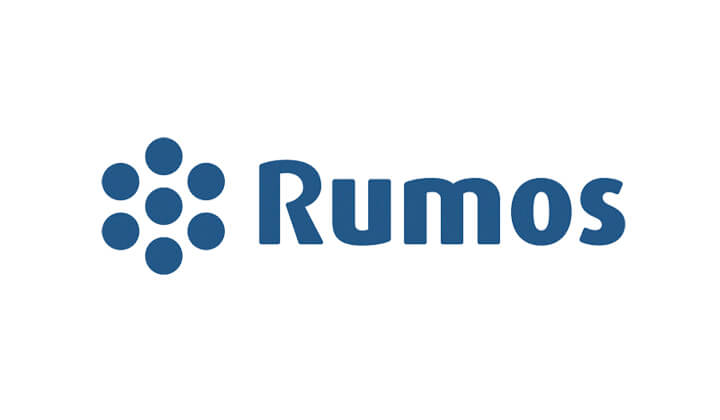

        

# Rumos Bank - Machine Learning Operations Project

  
Table of Contents

  <ol>
    <li>
      <a href="#about-the-project">About The Project</a>      
    </li>
    <li>
      <a href="#getting-started">Getting Started</a>     
    </li>  
    <li>
      <a href="#mlflow">Notebook and MLflow Tracking Server</a>     
    </li> 
    <li>
      <a href="#api">API</a>     
    </li>
    <li>
      <a href="#ui">User Interface</a>     
    </li> 
    <li>
      <a href="#packages">Packages</a>     
    </li>
    <li>
      <a href="#cicd">CI/CD</a>     
    </li>
    <li>
      <a href="#tests">Tests</a>     
    </li>
  </ol>  

<h2 id="about-the-project">About The Project</h2>

This project was developed as the final assessment for the module machine learning operations (MLOps) of the postgraduate degree in data science. This is an academic project, which means that all the information is fictitious, the rumos bank doesn't exist.

The Rumos Bank is a bank that has been losing a lot of money due to the amount of credit it provides that isn't paid back on time. We have been hired to help to develop a model that predicts which clients won't meet their deadlines. However the bank had a previous bad experience with a team of data scientists that took too long to put the model into production. The main goal of this project is not only to develop the model but also ensuring that the engineering team can feed the model into production efficiently.

<h2 id="getting-started">Getting Started</h2>

If you want to contribute to this project you can fork it and then clone your own repository to your local machine:

<pre><code>git clone https://github.com/your_usermane/OML_bank_project.git</code></pre>

after that you need to set up the virtual environment with all the necessary libraries using the conda.yaml file:

<pre><code>conda env create -f conda.yaml</code></pre>

finally you just need to activate the virtual environment with:

<pre><code>conda activate venv</code></pre>

if you want to deactivate the venv, you can:

<pre><code>conda deactivate venv</code></pre>

<h2 id="mlflow">MLflow Tracking Server</h2>

The notebooks used for this project are in the folder notebooks. 

The rumos_bank_lending_prediction.ipynb file contains the research done in order to find the best model. 
For each model, first was used grid search to find the best hyperparameters and then a run was created to log them into the MLflow tracking server. After this, all the models were compared and the best was defined as the @champion, which means it will be the one feed into production.

All the information is being saved into the local folder mlruns, which means that every time the MLflow server runs it will upload the models from this folder.

If you want to run the MLflow tracking server with Docker you only need the first service from the docker-compose.yaml file,

<pre><code>services:
  mlflow-tracking-server:
    container_name: mlflow-tracking-server
    image: ghcr.io/mlflow/mlflow
    command: mlflow ui --port 5000 --host 0.0.0.0 --backend-store-uri ./mlruns --artifacts-destination ./mlruns
    volumes:
      - ./mlruns:/mlruns
    ports:
      - 5000:5000
</code></pre>

and then run the following command in the terminal:

<pre><code>docker compose up -d --build</code></pre>

<h2 id="api">API</h2>

<h2 id="ui">User Interface</h2>

<h2 id="packages">Packages</h2>

<h2 id="cicd">CI/CD</h2>

<h2 id="tests">Tests</h2>

https://github.com/othneildrew/Best-README-Template/blob/main/BLANK_README.md
