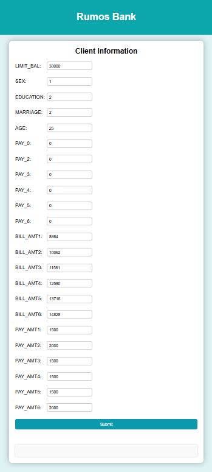

        

# Rumos Bank - Machine Learning Operations Project

  
Table of Contents

  <ul>
    <li>
      <a href="#about-the-project">About The Project</a>      
    </li>
    <li>
      <a href="#getting-started">Getting Started</a>     
    </li>  
    <li>
      <a href="#mlflow">MLflow Tracking Server</a>     
    </li> 
    <li>
      <a href="#api">API</a>     
    </li>
    <li>
      <a href="#ui">User Interface</a>     
    </li>    
    <li>
      <a href="#cicd">CI/CD</a>     
    </li>    
  </ul>  

<h2 id="about-the-project">About The Project</h2>

This project was developed as the final assessment for the module machine learning operations (MLOps) of the postgraduate degree in data science. This is an academic project, which means that all the information is fictitious, the rumos bank does not exist.

The Rumos Bank has been losing a lot of money due to the amount of credit it provides that isn't paid back on time. We have been hired to help develop a model that predicts which clients won't meet their deadlines. However the bank had a previous bad experience with a team of data scientists that took too long to put the model into production. The main goal of this project is not only to develop the model but also ensuring that the engineering team can put the model into production efficiently.

<h2 id="getting-started">Getting Started</h2>

If you want to contribute to this project you can fork it and then clone your own repository to your local machine:

<pre><code>git clone https://github.com/your_usermane/OML_bank_project.git</code></pre>

after that you need to set up the virtual environment with all the necessary libraries using the conda.yaml file:

<pre><code>conda env create -f conda.yaml</code></pre>

finally you just need to activate the virtual environment with:

<pre><code>conda activate venv</code></pre>

if you want to deactivate the venv, you can:

<pre><code>conda deactivate venv</code></pre>

<h2 id="mlflow">MLflow Tracking Server</h2>

The notebooks used for this project can be found in the folder notebooks. 

The rumos_bank_lending_prediction.ipynb file contains the research done in order to find the best model. 
For each model, first was used grid search to find the best hyperparameters and then a run was created to log them into the MLflow tracking server, as well as the associated metrics. After this, all the models were compared and the best was defined as the @champion, which means it will be the one feed into production.

All the information is being saved into the local folder mlruns, which means that every time the MLflow server runs it will upload the models from this folder.

If you want to run the MLflow tracking server with Docker you only need the first service from the docker-compose.yaml file,

<pre><code>services:
  mlflow-tracking-server:
    container_name: mlflow-tracking-server
    image: ghcr.io/mlflow/mlflow
    command: mlflow ui --port 5000 --host 0.0.0.0 --backend-store-uri ./mlruns --artifacts-destination ./mlruns
    volumes:
      - ./mlruns:/mlruns
    ports:
      - 5000:5000
</code></pre>

and then run the following command in the terminal:

<pre><code>docker compose up -d --build</code></pre>

with the MLflow server running you can access it using the url: http://127.0.0.1:5000.

List of models saved into the MLflow server:

<ul>
  <li>Neural_networks</li>
  <li>Random_forest @champion</li>
  <li>Decision_tree</li>
  <li>SVC</li>
  <li>KNeighborsClassifier</li>
  <li>logistic_reg</li>
</ul>

Random Forest was selected as the model to be put into production (@champion), since it presented the best computacional time vs bussiness cost trade-off. For more information you can check the rumos_bank_lending_prediction notebook.

<h2 id="api">API</h2>

Using FastAPI framework was created an API that allows to make predictions using the @champion model available in MLflow. The API loads the model from the MLflow server and exposes three endpoints, one to make predictions based on a given input, one to get the parameters of the model and another one to get the model metrics.

If you want to use this API you can either build your own or use the lastest version of the package available in this repository. It is important to note that, in order to make predicitons the MLflow server should be running.

To use the API package with Docker you should add the service shown below to the docker-compose.yaml file used for the MLflow tracking server.

<pre><code>services:
  lending-prediction-service:
    container_name: lending-prediction-service
    image: ghcr.io/josecostamc/lending-prediction-service:latest    
    ports:
      - 5001:5001
</code></pre>

With both services created, API and MLflow server, all you need to do is to run the following command in the terminal:

<pre><code>docker compose up -d --build</code></pre>

To check if the API is working correctly you can access the url: http://127.0.0.1:5001/docs. 

<h3>Endpoints</h3>

<h4>/default_prediction [POST]</h4>

This endpoint expects a request that contains a JSON object with the features required by the model and the response will return a JSON object with the prediction.

Example of request JSON:
<pre><code>{
  "LIMIT_BAL": 30000,
  "SEX": 1,
  "EDUCATION": 2,
  "MARRIAGE": 2,
  "AGE": 25,
  "PAY_0": 0,
  "PAY_2": 0,
  "PAY_3": 0,
  "PAY_4": 0,
  "PAY_5": 0,
  "PAY_6": 0,
  "BILL_AMT1": 8864,
  "BILL_AMT2": 10062,
  "BILL_AMT3": 11581,
  "BILL_AMT4": 12580,
  "BILL_AMT5": 13716,
  "BILL_AMT6": 14828,
  "PAY_AMT1": 1500,
  "PAY_AMT2": 2000,
  "PAY_AMT3": 1500,
  "PAY_AMT4": 1500,
  "PAY_AMT5": 1500,
  "PAY_AMT6": 2000
}</code></pre>

Example of response JSON:
<pre><code>{
  "prediction": 0
}</code></pre>

<h4>/model_params [GET]</h4>

This endpoint returns the model parameters.

Example of response JSON:
<pre><code>{
  "bootstrap": "True",
  "ccp_alpha": "0.0",
  "class_weight": "balanced",
  "criterion": "gini",
  "max_depth": "None",
  "max_features": "sqrt",
  "max_leaf_nodes": "None",
  "max_samples": "None",
  "memory": "None",
  "min_impurity_decrease": "0.0",
  "min_samples_leaf": "1",
  "min_samples_split": "2",
  "min_weight_fraction_leaf": "0.0",
  "model": "RandomForestClassifier(class_weight='balanced', random_state=42)",
  "monotonic_cst": "None",
  "n_estimators": "100",
  "n_jobs": "None",
  "oob_score": "False",
  "random_state": "42",
  "scaler": "MinMaxScaler()",
  "scaler__clip": "False",
  "scaler__copy": "True",
  "scaler__feature_range": "(0, 1)",
  "seed": "42",
  "steps": "[('scaler', MinMaxScaler()), ('model', RandomForestClassifier(class_weight='balanced', random_state=42))]",
  "transform_input": "None",
  "verbose": "0",
  "warm_start": "False"
}</code></pre>

<h4>/model_metrics [GET]</h4>

This endpoint returns the model metrics.

Example of response JSON:
<pre><code>{
  "accuracy": 0.7885,
  "min_cost": 2493000,
  "recall": 0.5338918507235338,
  "roc_auc": 0.6968584493643273
}</code></pre>

<h2 id="ui">User Interface</h2>

The user interface gives you a more interactive and user friendly experience to interact with the endpoint and make predictions.

To use the UI you need to add a new service to the docker-compose.yaml file and use the package available in this repository as the image, as shown in the example below:

<pre><code>services:
  lending-prediction-ui:
    container_name: lending-prediction-ui
    image: ghcr.io/josecostamc/lending-prediction-ui:latest    
    ports:
      - 5002:5002
</code></pre>

Now, with the three services running (MLflow tracking server, API and UI) you can access to the url: http://127.0.0.1:5002 and predict if a client is likely to fail to pay the credict. 

Below you can see a preview of the UI.

        

<h2 id="cicd">CI/CD (Continuous Integration/Continuous Deployment)</h2>

In this project, we use github actions along with a CI/CD pipeline to automate the process of building, testing, and deploying the packages. Every pull request or push to the main triggers the pipeline, ensuring that the codebase remains stable.

<h3>Workflow</h3>

<ul>
  <li>Install Docker</li>
  <li>Build Tracking server + Service + UI images</li>
  <li>Install conda</li>
  <li>Create and activate virtual environment</li>
  <li>Tests</li>
  <li>Push service (API) + UI</li>
</ul>

You can view the full pipeline configuration in the .github/workflows/cicd.yaml file. If your CI/CD pipeline fails check the logs for errors.

<h3>Tests</h3

Service tests: validates that the API service has no errors, you can find them in ./tests/test_service.py.

<ul>
  <li>test_default_prediciton()</li>
    <ul>
      <li>assert response.status_code == 200 -> pass if the request was successful.</li>
      <li>assert "prediction" in response.json() -> pass if prediction exists in response.json.</li>
      <li>assert isinstance(response.json()["prediction"], int) -> pass if type of prediction value is int.</li>
      <li>assert response.json()["prediction"] == 0 -> pass if the output value for the given input is 0.</li>
    </ul>
  </li>
</ul>

<ul>
  <li>test_model_params()</li>
    <ul>
      <li>assert response.status_code == 200 -> pass if the request was successful.</li>      
    </ul>
  </li>
</ul>

<ul>
  <li>test_model_metrics()</li>
    <ul>
      <li>assert response.status_code == 200 -> pass if the request was successful.</li>      
    </ul>
  </li>
</ul>

Model tests: validates that the model is working corretly. 

<ul>
  <li>test_model_no_default()</li>
    <ul>
      <li>assert prediction[0] == 0 -> pass if the output value for the given input, which is supposed to be 0, is indeed 0.</li>      
    </ul>  
    <li>test_model_default()</li>
    <ul>
      <li>assert prediction[0] == 1 -> pass if the output value for the given input, which is supposed to be 1, is indeed 1.</li>      
    </ul>     
    <li>test_model_out_shape()</li>
    <ul>
      <li>assert prediction.shape == (1, ) -> pass if the output shape is correct.</li>      
    </ul> 
    <li>test_model_gender()</li>
    <ul>
      <li>assert prediction_male == prediction_female -> pass if the model prediction is equal for men and women with the remaining features unchanged, preventing gender bias.</li>      
    </ul>  
</ul>

 
You can run the tests locally with the following command line:

<pre><code>pytest</code></pre>

Note that you need to have the MLfow server, API and UI running.